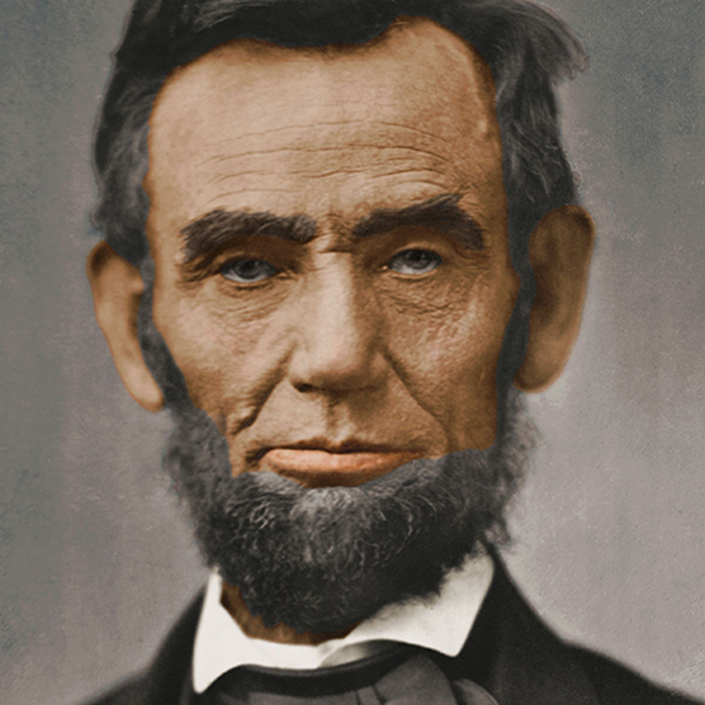

# ASCII Color Art Generator 🎨

A Python tool that converts images into colorful ASCII art! Generate ASCII art in three formats: traditional black & white text, colorful HTML, and colorful PNG images.

## Features ✨

- **Color Preservation**: Maintains original image colors in ASCII output
- **Multiple Output Formats**:
  - Traditional B&W ASCII text file (`.txt`)
  - Colorful HTML file (`.html`) - viewable in any browser
  - Colorful PNG image (`.png`)
- **Customizable Width**: Adjust ASCII art resolution
- **Smart Character Mapping**: Uses 11 ASCII characters based on pixel brightness

## Sample Results

### Input Images
Sample images used in this project:

| Original Image | Description |
|----------------|-------------|
|  | Abraham Lincoln portrait |
|  | TV setup photo |
|  | Black & white portrait |
|  | Laptop workspace |

### Output Examples

#### Color ASCII Art (PNG)
<table>
<tr>
<td></td>
<td></td>
</tr>
<tr>
<td></td>
<td></td>
</tr>
</table>

#### Color ASCII Art (HTML)
The HTML outputs can be viewed in any web browser and maintain the same colorful appearance!

#### Traditional B&W ASCII Art (Text)
Check the `output/` folder for `.txt` files with classic black & white ASCII art.

## Installation 📦

### Prerequisites
- Python 3.6 or higher
- pip (Python package installer)

### Step 1: Clone or Download the Repository
```bash
git clone <repository-url>
cd "ASCII art generator"
```

### Step 2: Create a Virtual Environment (Recommended)
```bash
# Windows
python -m venv venv
venv\Scripts\activate

# Linux/Mac
python3 -m venv venv
source venv/bin/activate
```

### Step 3: Install Required Dependencies
```bash
pip install -r requirements.txt
```

The `requirements.txt` includes:
- `Pillow` - Python Imaging Library for image processing

## Usage 🚀

### Basic Usage

1. **Activate the virtual environment** (if not already activated):
   ```bash
   # Windows
   venv\Scripts\activate

   # Linux/Mac
   source venv/bin/activate
   ```

2. **Run the script**:
   ```bash
   python script.py
   ```

3. **Enter the image path** when prompted:
   ```
   Enter image path: abe.jpg
   ```

4. **Check the output** in the `output/` folder!

### What Gets Generated?

For an input image named `example.jpg`, the script creates:
- `output/example_ascii_color.png` - Colorful ASCII art as a PNG image
- `output/example_ascii_color.html` - Colorful ASCII art as an HTML file (open in browser!)
- `output/example_ascii_bw.txt` - Traditional black & white ASCII art

### Customizing Width

You can modify the ASCII art resolution by editing the `main()` function call in `script.py`:

```python
if __name__ == "__main__":
    main(new_width=150)  # Default is 100, increase for more detail
```

- **Lower width** (50-75): Faster processing, less detail
- **Default width** (100): Balanced quality and size
- **Higher width** (150-200): More detail, larger file size

## How It Works 🔧

1. **Image Resizing**: Resizes the input image to the specified width while maintaining aspect ratio
2. **Grayscale Conversion**: Converts the image to grayscale to determine character brightness
3. **Character Mapping**: Maps pixel brightness to ASCII characters:
   ```
   Darkest → Lightest
   @  #  S  %  ?  *  +  ;  :  ,  .
   ```
4. **Color Preservation**: Retrieves the original RGB color for each pixel
5. **Output Generation**: Creates three different format outputs

## Project Structure 📁

```
ASCII art generator/
├── script.py                          # Main Python script
├── requirements.txt                   # Python dependencies
├── README.md                          # This file
├── venv/                              # Virtual environment (gitignored)
├── output/                            # Generated ASCII art files
│   ├── *_ascii_color.png             # Colorful PNG outputs
│   ├── *_ascii_color.html            # Colorful HTML outputs
│   └── *_ascii_bw.txt                # B&W text outputs
└── *.jpg, *.jpeg                     # Sample input images
```

## Tips & Tricks 💡

1. **Best Input Images**:
   - High contrast images work best
   - Portraits and faces produce great results
   - Simple backgrounds are easier to recognize

2. **Viewing HTML Output**:
   - Double-click the `.html` file to open in your default browser
   - Zoom in/out to adjust viewing size
   - Works great on mobile devices too!

3. **Sharing Your Art**:
   - PNG files are perfect for social media
   - HTML files can be embedded in web pages
   - TXT files work in any text editor

## Troubleshooting 🔧

### Issue: "No module named PIL"
**Solution**: Install Pillow
```bash
pip install Pillow
```

### Issue: Font not found warnings
**Solution**: The script automatically falls back to available fonts. No action needed!

### Issue: Image path not found
**Solution**: Use the full path to your image
```
# Windows example
Enter image path: C:\Users\YourName\Pictures\photo.jpg

# Or use relative path
Enter image path: ./myimage.jpg
```

## Requirements 📋

- Python 3.6+
- Pillow (PIL) library
- Approximately 50MB disk space for output files (varies by image count)

## License 📄

This project is open source and available for personal and educational use.

## Contributing 🤝

Feel free to fork this project and submit pull requests for improvements!

## Acknowledgments 🙏

- ASCII character set inspired by classic ASCII art techniques
- Built with Python and Pillow (PIL)

---

**Enjoy creating ASCII art!** 🎨✨

